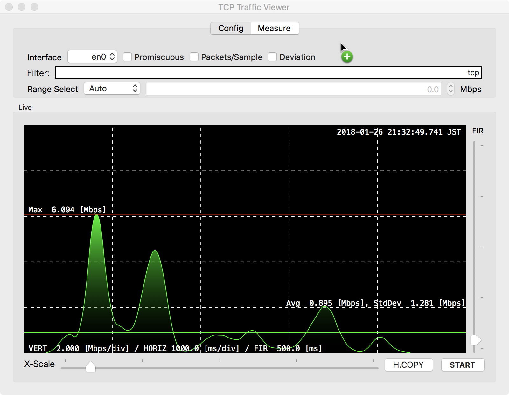

xtcpshow
========

# A Network Traffic Grapher for Mac OS X

# HOW TO USE
1. launch the application
2. selelct your network interface
2. press "START" button

## launch the application

Simply launch the application from Dock, Finder, etc. The application doen't need administrator priviledge on starting.

## select your network interface

1. Select "Config" tab on the top of window
2. Select your favorite network interface(en0, en1, ppp0, ...) from combo-box at the top-right
3. If you want show the packet which doen't toward to your Mac, check "Promiscuous" check-button. If promiscuous mode was enabled on broadcast network interface(i.e. Ethernet), all packet on the wire are received by the interface. If not, only packets for your Mac are received. The promiscuous mode can cause a serious CPU load in your Mac. If your Mac seems not responding, try the interface to be disconnected.

## press START button

1. On START button cliked, the application try to open /dev/bpf, the Berkley Packet Filtering device.
2. /dev/bpf has restrected premission to open. If your system configured to need administrator(root) privilege on /dev/bpf (this is factory default), the application prompt you to enter password to install priviledged helper tool into /Library/PrivilegedHelperTools. There are some applications that changes permission of /dev/bpf. For example, some version of wireshark create UNIX group 'access_bpf' and set /dev/bpf group readable/wriable. In such case, the application doen't prompt your password.
3. If everythings OK, the application shows traffic graph.

# Configure the view

## Mbps calculation

Traffic sampling logic of the application is on the following.

1. Caputer a packet on /dev/bpf and record the bytes received and time stamp.
2. Calculate triangle moving average for the bytes received.
3. Calculate mbps of the averaged bytes received.

### Range of the View

The X-axis range can be controlled by horizontal scroll bar.

### Triangle Moving Average

The application calculate the viewing bytes received at time t (vbytes[t]) as average of captured bytes(cbytes[t]) for last MA[sec]. For exapmle, vbytes[t0] = Avg(cbytes[t0] .. cbytes[t0 - MA]). you can configure the value of MA by vertical slider.

The lesser MA shows accurate timing of the packet. And the lesser MA will have been resemling the differentials of the traffic. If MA was 0, the mbps become infinity. The more MA shows integral of the traffic(on the other words, the more MA is worked as same as low pass filter).

### Packet histgram

You can show a histgram of the number of packets received by checking 'packets/sample' check-box in Config tab. The hisgram was shown in cyan color and overlayed on the mbps graph. The phase of this histgram and moving average are synchronized automatically.

### Mbps distribution(deviation)

You can show a standard deviation band by checking 'deviation' check-box. If the distrubition of traffic seems to a normal distribution, this band may become a some help you. The distribution of enough multiplexed traffic may be a normal distribution, but I think most of traffics are not.
